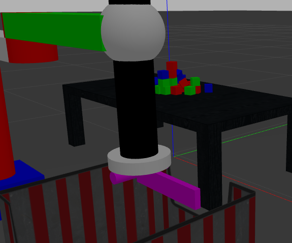

# NPM_1.0

NPM is a Non - Prehensile Manipulator I have built in ROS for Pushing and Flattening piles. This project based on an environment which consists of Table, a pile of boxes resting on the table, Kinect Camera mounted parallel to the table and the Scara Manipulator. The main aim in the project is to flatten the pile as fast as possible with the help of robotic arm and the depth camera without the boxes falling off the table.

## Problem Description
In the municipal waste recycling industry, recyclables are not pre-sorted and are sent to a Material Recovery Facility (MRF) for sorting. Laborers at conveyor belts will separate desired materials from undesired materials. Working conditions are unpleasant and tedious.Sorting the pile of waste is not easy and takes lots of time. A solution should be developed which will aim to automate certain aspects of sorting the pile of waste.

## Pushing Manipulation Gripper

## Installations
ROS --Version

- ROS Melodic : Ubuntu 18.04
- Other versions might be supported. It just that I have tested the project on ros melodic and it works completely fine

Install ROS Controller

- `sudo apt-get update` 
- `sudo apt-get upgrade` 
- `sudo apt-get dist-upgrade` 
- `rosdep update`
- `sudo apt-get install ros*controller*`

Install Moveit

- `sudo apt-get install moveit`

## How to use the package

Building the package

- `catkin build npm_1 npm_1_config_1` or `catkin make npm_1 npm_1_config_1`

- `source ~/catkin_ws/devel/setup.bash`

Launching the Socioulator Robot

- `roslaunch npm_1 robot.launch`

Run the Node for communication with the Robot

- `rosrun sociopulator robot_1.py`

## About NPM-1.0

## NPM - ROS Package
