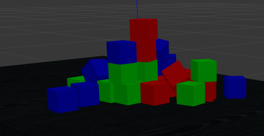

# NPM_1.0

NPM is a Non - Prehensile Manipulator I have built in ROS for Pushing and Flattening piles. This project is based on an environment which consists of Table, a pile of boxes resting on the table, Kinect Camera mounted parallel to the table and the Scara Manipulator. The main aim in the project is to flatten the pile as fast as possible with the help of robotic arm and the depth camera without the boxes falling off the table.

## Problem Description
In the municipal waste recycling industry, recyclables are not pre-sorted and are sent to a Material Recovery Facility (MRF) for sorting. Laborers at conveyor belts will separate desired materials from undesired materials. Working conditions are unpleasant and tedious.Sorting the pile of waste is not easy and takes lots of time. A solution should be developed which will aim to automate certain aspects of sorting the pile of waste.

## About NPM-1.0
NPM is a Non -prehensile Scara Manipulator made for flattening and sorting the pile of objects in a cluttered environment. It uses a single horizontal link(gripper in pink colour in the above image) which can rotate from 0 - 180 degrees to push and sort the objects.

## Flattening the Pile

The flattening of pile involves 3 main steps:
- Detection of the Pile: The detection of pile is done by the kinect camera mounted at the top above the table.The detection of this pile is done by processing the depth information of the image.

- Level Sets: Level sets is set of level curves which divides the shapes into set of different heights.Level curve is the specific height of shape. For example, lets say there is a building of 15 floors. These individual floors are nothing but different level curves of the building. The combination of these all floors is called a level set. Zero level curve is the first floor and final level curve is the 15th floor of the building. So basically the robot knows how much the pile is flattened or not flattened with the help of these level curves.

- Pushing: Pushing manipulation is kind of manipulation in which the robotic arm pushes the objects to a specific distance. In pile sorting, this arm uses pushing manipulation to flatten the pile by the cutting the level curves one by one or altogether depending upon the situtation.

## Pushing Manipulation Gripper

## Installations
ROS --Version

- ROS Melodic : Ubuntu 18.04
- Other versions might be supported. It just that I have tested the project on ros melodic and it works completely fine

Install ROS Controller

- `sudo apt-get update` 
- `sudo apt-get upgrade` 
- `sudo apt-get dist-upgrade` 
- `rosdep update`
- `sudo apt-get install ros*controller*`

Install Moveit

- `sudo apt-get install moveit`

## NPM - ROS Package

Note: The Project is still not completed and is under process of development.

Building the package

- `catkin build npm_1 npm_1_config_1` or `catkin make npm_1 npm_1_config_1`

- `source ~/catkin_ws/devel/setup.bash`

Launching the Robot in Gazebo

- `roslaunch npm_1 robot_2.launch`

Run the Node for communication with the Robot

- `rosrun sociopulator robot_1.py`

## Demonstration Video.

